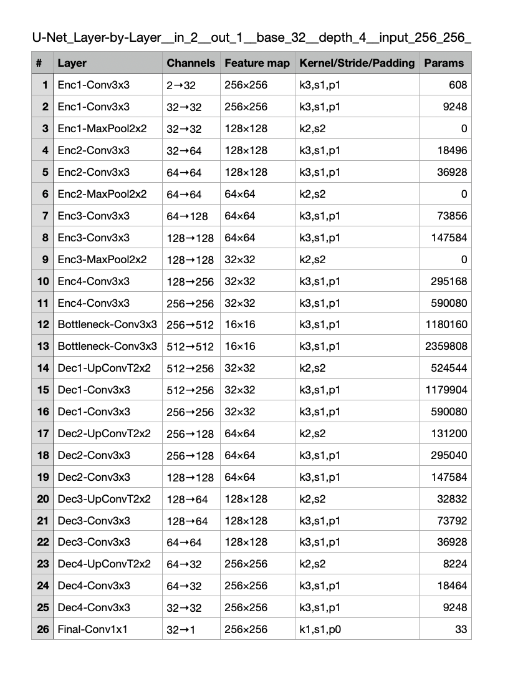
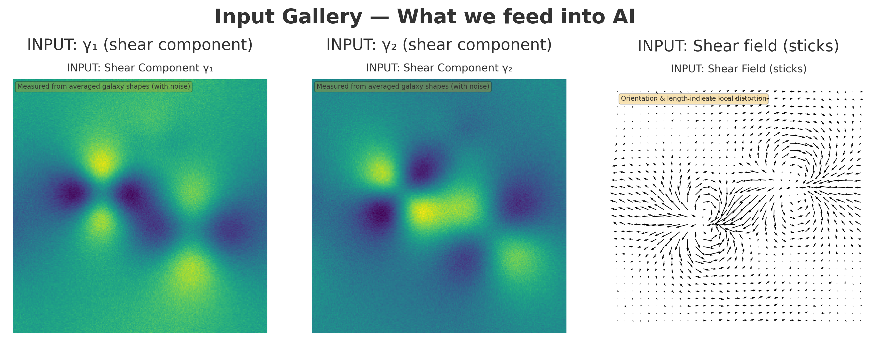
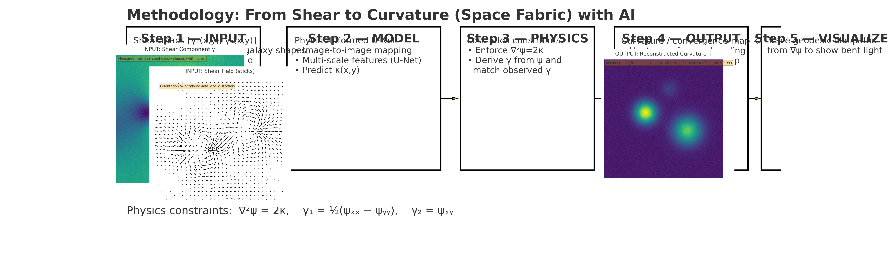

# Geometric Intelligence
# Geometry-Lensing & U-Net (CPU)

Inline comparison, input gallery, and pipeline:

<p align="center">
  
  <br>
  
  <br/>
  
</p>

## Contents
- `unet_cpu_train.py` — Train a U-Net on CPU  
- `unet_cpu_infer.py` — Run CPU inference and save masks/overlays  
- `lensing_without_ai.py` — Simple gravitational-lensing style demo (no AI)  
- `comparison.png`, `input_gallery(1).png`, `methodology_pipeline_clean_h(1).png` — figures used in this README

---

## 1) Step 1

```bash
# 1) Clone
git clone kawdoco/geometric_intelligence
cd geometry-lensing-unet

# 2) (Optional) create a venv
python -m venv .venv
# Windows: .venv\Scripts\activate
# Linux/Mac:
source .venv/bin/activate

```

## 2) Step 2 Install (CPU-only)

```bash
# (venv) python -m pip install --upgrade pip
# (venv) python -m pip install numpy matplotlib pillow

# Then run with the venv’s python:

# (venv) python lensing_without_ai.py

# Check the auto created folder and check images that you generated
```

## 3) Step 3 – play with CPU AI Install Packages

```bash
# (venv) python -m pip install --upgrade pip
# (venv) python -m pip uninstall -y torch numpy
# (venv) python -m pip install "numpy==1.26.4”
# CPU-only torch wheel (works on Mac/CPU)
# (venv) python -m pip install torch --index-url https://download.pytorch.org/whl/cpu

# Then run with the venv’s python:Train on CPU (small & fast)

# (venv) python unet_cpu_train.py --epochs 5 --samples 512 --size 128 --noise 0.02
```

## 4) Step 4 - inference with CPU AI Inference demo (CPU)
```bash
# python unet_cpu_infer.py --size 128
# Now check newly created folders and images , please kindly fix your python errors by yourself.
# This will create an outputs_unet/ folder
# with:tiny_unet_cpu.pth (weights)train_curve.png (loss vs epoch)sample_train_pred.png
# (target κ vs predicted κ̂ from training set)infer_pred.png (γ₁, γ₂, and predicted κ̂ for a new sample)
```

## 4) Step 5 - Upload 
```bash
https://forms.gle/3899XVpV9KLLwQRz8
```
